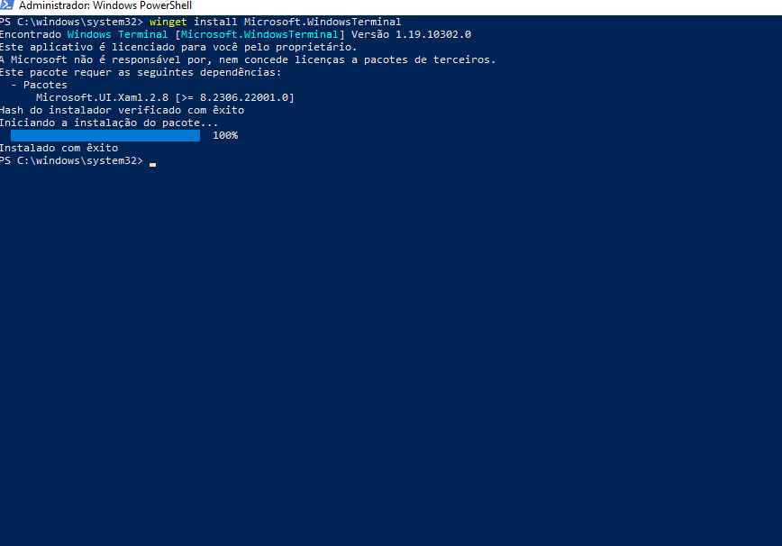
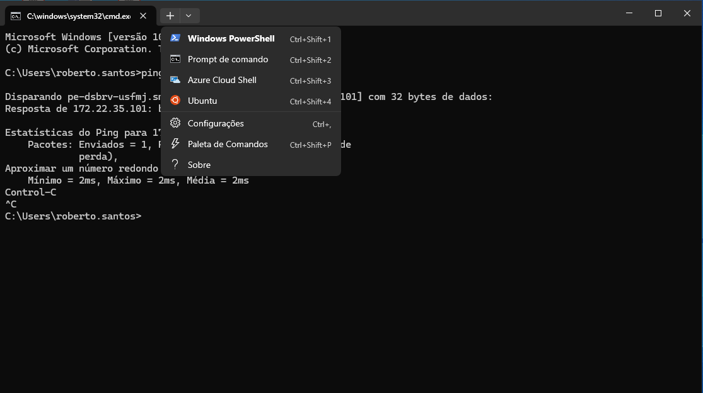
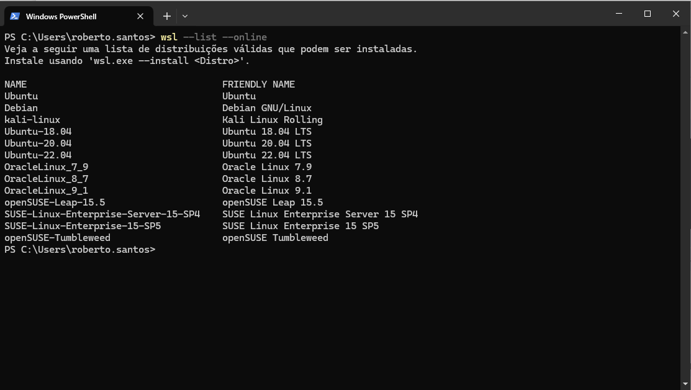
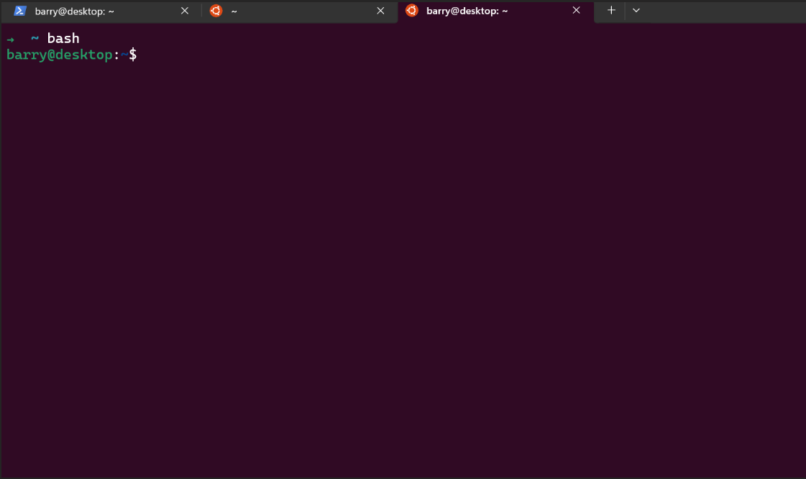

# WIP - Configurando o ambiente linux, docker e VSCode no Windows

## Motivação

Auxiliar na configuração de um ambiente de desenvolvimento para as aplicações *Linux Native* utilizando *WSL, Docker, Windows Terminal, VSCode*.

## Instalador de Aplicativos (winget)

O Instalador de Aplicativos da Microsoft é um utilitário que permite a instalação de pacotes do Windows através do terminal. A instalação está disponível na [Microsoft Store](https://www.microsoft.com/p/app-installer/9nblggh4nns1).

## Windows Terminal

O Windows Terminal é um aplicativo de terminal moderno, rápido, eficiente, poderoso e produtivo para os usuários de ferramentas e shells de linha de comando, como prompt de comando, PowerShell e WSL. Seus principais recursos incluem várias guias, painéis, suporte a caracteres Unicode e UTF-8, um mecanismo de renderização de texto acelerado por GPU e temas, estilos e configurações personalizados.

Para instalar o **Windows Terminal**, execute o  PowerShell como administrador e execute o comando:

```
 winget --install Microsoft.WindowsTerminal
```
<div align="center">
    
    <p>Instalação do Windows Terminal.</p>
</div>

<br/>

<div align="center">
    
    <figcaption>Interface do Windows Terminal.</figcaption>
</div>

<br/>

## Subsistema do Windows para Linux - WSL

O Subsistema do Windows para Linux (WSL) é um recurso nativo do Windows, disponível a partir do **Windows 10 - 1909** que permite executar um ambiente Linux em seu computador Windows, sem a necessidade de uma máquina virtual separada ou inicialização dupla. O WSL foi projetado para fornecer uma experiência perfeita e produtiva para desenvolvedores que desejam usar o Windows e o Linux ao mesmo tempo.

O WSL permite que os desenvolvedores instalem uma distribuição do Linux (como Ubuntu, OpenSUSE, Kali, Debian, Arch Linux etc) e usem aplicativos, utilitários e ferramentas de linha de comando bash do Linux diretamente no Windows, sem modificação, sem a sobrecarga de uma máquina virtual tradicional ou configuração dualboot.

Por padrão utilizaremos o sitema operacional Ubuntu:

```
wsl --install --distribution Ubuntu
```

Depois de instalado o sistema solicitará a configuração de um usuário e senha. Este usuário possui privilégios administrativos (sudo), e nos ajudará na manutenção do sistema operacional.

Caso queira instalar ou verificar quais as distribuições estão disponíveis:

```
wsl --list --online
```

A saída do comando será:

<div align="center">

<figure>
    
    <!-- <figcaption>Saída do comando.</figcaption> -->
</figure>

</div>


Após instalação é necessário reiniciar o seu computador para que as alterações tenham efeito.

Depois de reiniciado, abra novamente o Windows Terminal e selecione a aba correspondente ao Linux.

<div align="center">

<figure>
    
    <figcaption>Shell Linux.</figcaption>
</figure>

</div>

<br/>

## Docker Desktop
